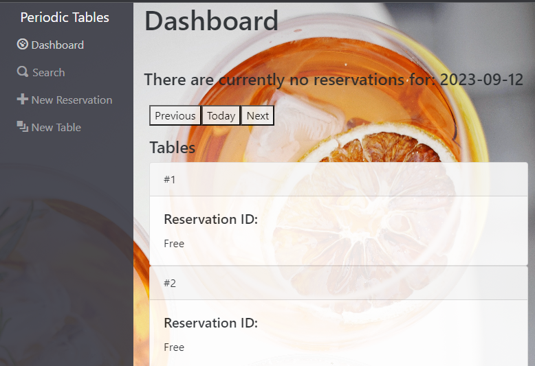
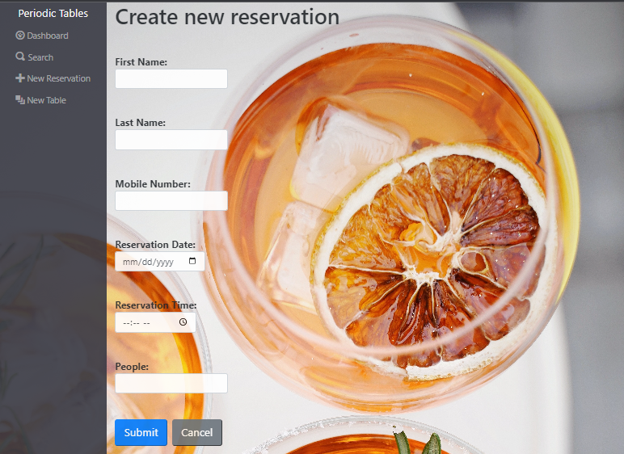
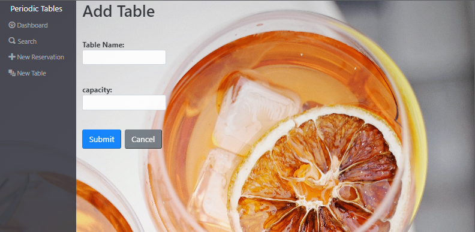
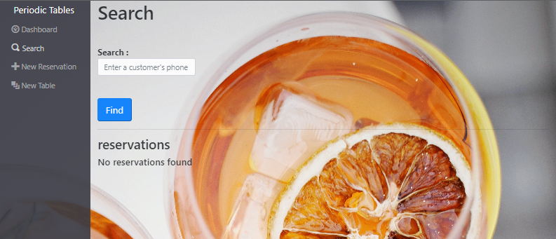
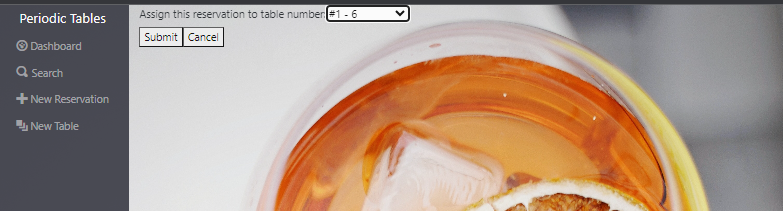
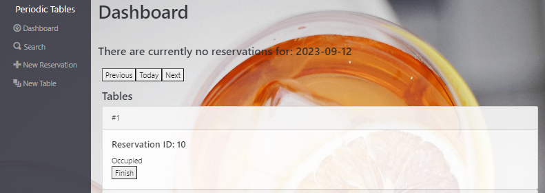
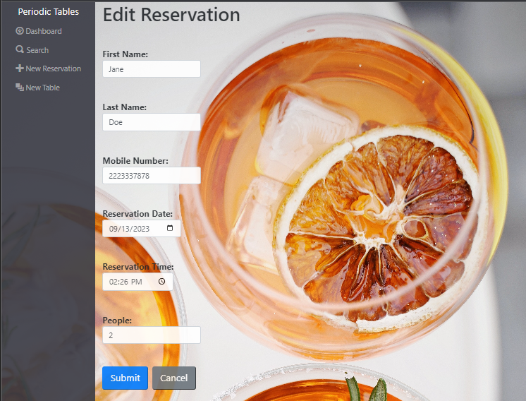
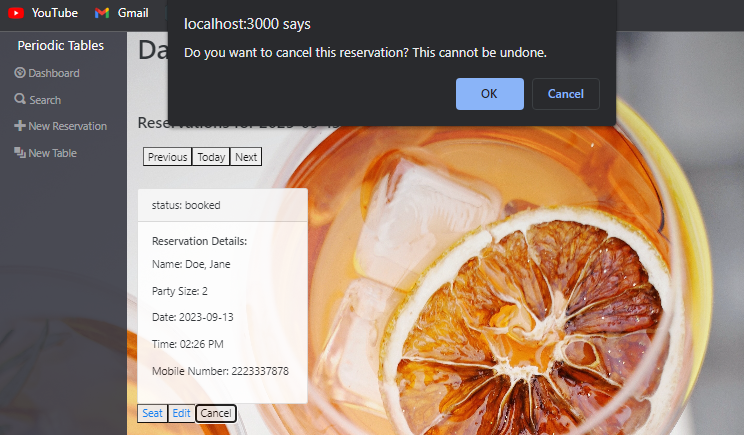

# Capstone: Restaurant Reservation System

> This is Thinkfuls final capstone project. The goal of this project is to create a reservation app to handle CRUD features for a particular restaurant while adhering the owners guidelines.

## Project Description

This application is designed with the restaurants user stories in mind. This CRUD application allows the restaurant to handle reesrvation management easily while sticking to proper coding techniques. 

The technologies used in this application are:

frontend: react, boostrap

backend: node, express, pupeteer

database: postgreSQL

While building this complex application I learned alot along the way and stumbled a bit as well. Understanding what APIs do and how to debug them helped me tremendously throughout this project

### How to install and run project

For this project you must install a version of node previous to node 16v
1. Fork and clone this repository.
1. Run `cp ./back-end/.env.sample ./back-end/.env`.
1. Update the `./back-end/.env` file with the connection URL's to your ElephantSQL database instance.
1. Run `cp ./front-end/.env.sample ./front-end/.env`.
1. You should not need to make changes to the `./front-end/.env` file unless you want to connect to a backend at a location other than `http://localhost:5001`.
1. Run `npm install` to install project dependencies.
1. Run `npm run start:dev` to start your server in development mode.
                   
                   
### Navigating the client

The Periodic Table sidebar will display options to navigate to different components of the app. 
The Dashboard will display reservations made for todays date as well as tables avaliable in the restaurant and includes three buttons for navigating current, previous, and future dates for reservations.
(note: restaurant does not open on Tuesdays and it is open everyone other day from 10am to 10pm. No reservations may be made within 60 min of restaurant closing)

 

New reservations may be created by filling in the form with proper data so long as time and date fields do not violate any of the restaurant rules. Submitting creates a new reservation and navigates you to the date the reservation was made for otherwise cancelling it returns you to the Dashboard.

 

New tables may be added to the restaurant at any time to accomodate more guests.

 

Search tab allows you to find a reservation regardless of status by typing in a full or partial phone number, if successful it displays the reservation(s) found and gives you the option to edit it.

When a table arrives you may seat them by clicking the seat button underneath the reservation on the dashboard. This will allow you to choose a table to seat a reservation at so long as the table is not a bar seat or cannot accomodate the party size. once a table is seated, it changes the status to 'seated' and removes the reservation from the reseravtion list.
 
 

clicking finish on the seated table will remove the reservation from the table and make it avaliable to be used again.

clicking edit allows you to edit the reservation info if submitted.
 

And clicking 'cancel' button under a reservation will display a pop up asking to confirm the deletion of the reservation. if 'ok' the reservation is deleted. 
 

### Final Thoughts
I just wanted to say Thank You for checkout out my capstone! I specially wanna thank all who guided me thru this wonderful journey. To my mentors Daniel and Valerie, I appreciate the time you both spent with me guiding me every step of the way. I really couldn't have done it with out all of you!

If you have any final questions, reach out to me thru GitHub or my socials!